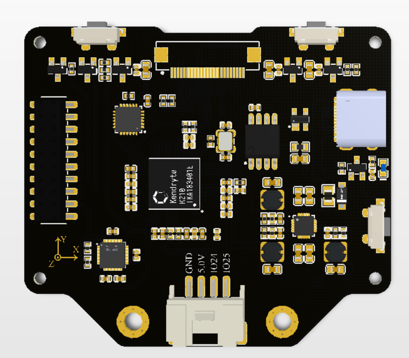
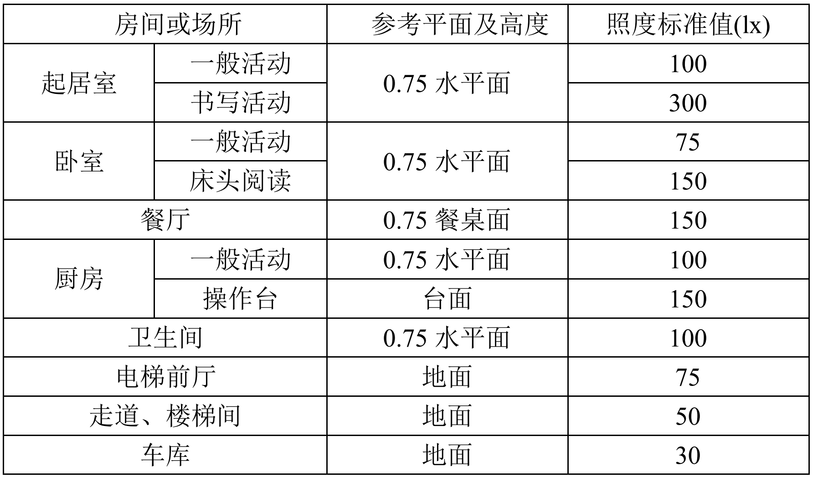

.. OpenAIE documentation master file, created by
   sphinx-quickstart on Wed Apr 29 10:16:47 2020.
   You can adapt this file completely to your liking, but it should at least
   contain the root `toctree` directive.

OpenAIE 启蒙 使用说明文档
===================================

	启蒙是OpenAIE系列模块

	
	
----------------

简介
####

* 供电方式：USB TypeC（DC: 5V）
* 处理器: K210，RISC-V 64 位双核 CPU，主频：400MHz；具备卷积人工神经网络硬件加速器 KPU，可高性能进行卷积人工神经网络运算。
* 存储：Flash：8MiB; SRAM：8MiB; 支持SD卡拓展
* 图像传感器：200万像素彩色摄像头（OV2640）
* 显示屏：2.0英寸，分辨率240*320，IPS全视角彩色显示屏
* 板载功能：
	+ 1. 三颗可编程全彩LED
	+ 2. 两个白光LED
	+ 3. 两个按键
	+ 4. 无源蜂鸣器
	+ 5. 三轴陀螺仪，三轴加速度计
	+ 6. 光照强度传感器
	+ 7. 非特定人语音识别模块
+ 拓展接口：Grove(UART/I2C/GPIO) 

----------------

入门使用
===================================

1. 软件安装
####
	点击下载
	打开安装

2. 驱动安装
####	
	
3. 案例测试
####

----------------

板载功能使用教程 
===================================

1. RGB LED
####

板载三颗RGB全彩LED，每种颜色可实现0~255共256级亮度调节，通过对红(Red)、绿(Green)、蓝(Blue)三个颜色通道的调节可叠加发出多种颜色的光。

::

设置 RGB LED 参数::

	# id：板载灯编号，由左至右为：0，1，2；
	# r,g,b：为颜色亮度值，取值范围：0~255 
	rgb.set(id, (r, g, b)) 
	
	# 或：
	color = (r, g, b)  # tuple类型 
	rgb.set(id, color)  

将设置值输出显示::

	rgb.display()  

.. Note:: 每种颜色的LED共有2^8=256(0~255)个发光等级，即共有2^8^3=16 777 216种颜色组合。通过查找 \ `RGB颜色对照表 <https://tool.oschina.net/commons?type=3>`_ 生成自己喜欢的颜色。

示例1：点亮LED
::
	from openaie import *		# 导入模块
	rgb.set(0, (5, 0, 0))		# 将第1个灯设置为红色亮度值为：5
	rgb.set(1, (0, 10, 0))		# 将第2个灯设置为蓝色亮度值为：10
	rgb.set(2, (0, 0, 100))		# 将第3个灯设置为绿色亮度值为：100
	rgb.display()			# 输出显示

示例2：颜色渐变
RGB彩虹色渐变算法: https://www.cnblogs.com/wzdxy/p/5346930.html
::
	def wheel(pos):
		# 通过改变在0和255之间的每个颜色参数产生彩虹色光谱
		# Input a value 0 to 255 to get a color value.
		# The colours are a transition r - g - b - back to r.
		if pos < 0 or pos > 255:
			r = g = b = 0
		elif pos < 85:
			r = int(pos * 3)
			g = int(255 - pos*3)
			b = 0
		elif pos < 170:
			pos -= 85
			r = int(255 - pos*3)
			g = 0
			b = int(pos*3)
		else:
			pos -= 170
			r = 0
			g = int(pos*3)
			b = int(255 - pos*3)
		return (r, g, b)

	def rainbow_cycle(wait_ms):
		# 彩虹效果
		n=3
		for j in range(255):
			for i in range(n):
				pixel_index = (i * 256 // n) + j
				rgb.set(i, wheel(pixel_index & 255)) 
			rgb.display()
			time.sleep_ms(wait_ms)
	 
	while True:
		rainbow_cycle(10)	
		
----------------

2. 补光LED
####

后置两颗白光LED，可用于摄像头的背光灯等。可通过编程控制亮度。

.. Note:: 不能单独控制

设置灯亮度::

	# brightness 亮度，取值范围: 0~100
	lamp.set(brightness) 
	
示例1：呼吸灯
::
    from openaie import * 	 
    import time
  
    dir = True
    while True:
        for i in range(80):
            if dir :
                lamp.set(i)	
            else :
                lamp.set(100 - i)
                time.sleep(0.05)
        dir = not dir

----------------

3. 蜂鸣器
####
无源蜂鸣器，可通过不同频率的信号驱动，发出不同音调的声音。

蜂鸣器鸣响::

	# freq：频率；time_ms：时间，单位为：毫秒
	buzzer.tone(freq, time_ms) 

关闭蜂鸣器::

	buzzer.no_tone()	

示例1：依次发出 Do、Re、Mi、Fa、Sol、La、Si
::
	tone_list = (289, 661, 700, 786, 882, 990, 1112)
	for i in range(7):	
		buzzer.tone(tone_list[i])
		time.sleep_ms(500)
	buzzer.no_tone()

----------------

4. 按键
####
左右两个按键

获取按键状态::

	# 返回布尔值，True：按键按下，False：按键弹起。
	button_left.is_press() 
	button_right.is_press() 

示例1：按键控制开关灯 
::
	from openaie import*
	while (True):
		if button_left.is_press(): # 检测到按键按下
			utime.sleep_ms(10)
			if button_left.is_press():
				print("left button press")
				lamp.set(20)
			while (button_left.is_press()) : # 等待按键释放
				pass
		if button_right.is_press(): # 检测到按键按下
			utime.sleep_ms(10)
			if button_right.is_press():
				print("right button press")
				lamp.set(0)
			while (button_right.is_press()) : # 等待按键释放
				pass  

----------------

5. 光照强度传感器
####

https://www.cnblogs.com/zlbg/p/4049962.html

光照强度传感器可检测光照强度，测量范围：1~65535lx(勒克斯)

读取环境光照强度值::

	# 返回光照强度，单位：lx(勒克斯)
	light.read() 

 
示例1：读取并输出光照强度
::
	from openaie import*
	while True:
		brightness = light.read()
		print("brightness: %d lx"%brightness)
		if brightness < 50:  # 当亮度小于一定值时，打开灯
			lamp.set(20)
		else :
			lamp.set(0)
		time.sleep_ms(100)

住宅建筑照明标准值

----------------

6. 姿态传感器
####

惯性测量单元

.. ref:: 飞行器姿态角：https://blog.csdn.net/u012763833/article/details/52396133

API::

	# 获取加速度值，单位：m/s^2
	# axis: 'x', 'y', 'z'
	imu.get_accel(axis) 	

	# 获取角速度值，单位：°/S
	# axis: 'x', 'y', 'z'
	imu.get_gryo(axis) 

	# 获取姿态角(roll - 横滚角，pitch - 俯仰角，yaw - 偏航角)
	# sel: 'roll', 'pitch', 'yaw' 
	ime.get_attitude(sel)

::
	# ...

----------------
	
7. 语音识别
####

非特定人语音识别

添加识别关键词
::
	#str：设别语句的拼音
	#ret: 识别到关键词时的返回值
	asr.add_cmd(str, ret)
	
开始运行
::	
	asr.run()	
	
读取识别结果 
::			
	asr.read()	

.. Note:: 安静的环境中可获得较大的识别准确率

示例1：
::
	from openaie import *
	import time
	asr.add_cmd("hong", 1)		# 添加关键词“红”，返回值为：1
	asr.add_cmd("lv", 2)		# 添加关键词“绿”，返回值为：2
	asr.add_cmd("lan", 3)		# 添加关键词“蓝”，返回值为：3
	asr.add_cmd("kai deng", 4)	# 添加关键词“开灯”，返回值为：4
	asr.add_cmd("guan deng", 5)	# 添加关键词“关灯”，返回值为：5
	asr.run()

	def asr_test(sel):
		if sel == 1 :
			print("red")
			rgb.set(0, (20, 0, 0))
			rgb.display()
		elif sel == 2 :
			print("green")
			rgb.set(0, (0, 20, 0))
			rgb.display()
		elif sel == 3 :
			print("blue")
			rgb.set(0, (0, 0, 20))
			rgb.display()
		elif sel == 4 :
			print("turn on the light")
			lamp.set(10)
		elif sel == 5 :
			print("turn off the light")
			lamp.set(0)
			rgb.set(0, (0, 0, 0))
			rgb.display()

	while True:
		asr_test(asr.read_res())  
		time.sleep_ms(100)	

示例2：增加语音唤醒设置
::
	import time
	import random
	from openaie import *
					 
	asr_run = False 
	res_str = ('我在', '你说......', '诶！', '来啦', '嗨!')

	asr.add_cmd("hong", 1)                  # 添加关键词“红”，返回值为：1
	asr.add_cmd("lv", 2)                    # 添加关键词“绿”，返回值为：2
	asr.add_cmd("lan", 3)                   # 添加关键词“蓝”，返回值为：3
	asr.add_cmd("kai deng", 4)              # 添加关键词“开灯”，返回值为：4	
	asr.add_cmd("guan deng", 5)             # 添加关键词“关灯”，返回值为：5
	asr.add_cmd("xiao ming tong xue", 66)   # 唤醒词
	asr.add_cmd("tui xia", 65)              # 退出
	asr.run()

	def asr_test(sel):
		global asr_run
		if sel == 66:
			asr_run = True
			rgb.set(1, (0, 20, 0))
			rgb.display()
			print(res_str[random.randint(0, 4)])
		elif sel == 65:
			asr_run = False 
			rgb.set(1, (0, 0, 0))
			rgb.display()
			print("=========== END ===========")
		if asr_run == True:
			if sel == 1 :
				print("red")
				rgb.set(0, (20, 0, 0))
				rgb.display()
			elif sel == 2 :
				print("green")
				rgb.set(0, (0, 20, 0))
				rgb.display()
			elif sel == 3 :
				print("blue")
				rgb.set(0, (0, 0, 20))
				rgb.display()
			elif sel == 4 :
				print("turn on the light")
				lamp.set(10)
			elif sel == 5 :
				print("turn off the light")
				lamp.set(0)
				rgb.set(0, (0, 0, 0))
				rgb.display()

	while True:
		asr_test(asr.read_res())  
		time.sleep_ms(100)	
	
	
----------------

综合测试程序
::
	import utime
	from openaie import*
	import sensor, image, time, lcd

	lcd.init(freq=15000000)
	lcd.direction(lcd.YX_LRUD)
	sensor.reset()                      # Reset and initialize the sensor. It will
	sensor.set_hmirror(False)
	sensor.set_vflip(False)             # run automatically, call sensor.run(0) to stop
	sensor.set_pixformat(sensor.RGB565) # Set pixel format to RGB565 (or GRAYSCALE)
	sensor.set_framesize(sensor.QVGA)   # Set frame size to QVGA (320x240)
	sensor.skip_frames(time = 100)      # Wait for settings take effect.
	clock = time.clock()                # Create a clock object to track the FPS.

	while(True):
		clock.tick()                    # Update the FPS clock.
		img = sensor.snapshot()         # Take a picture and return the image.
		lcd.display(img)                # Display on LCD
		print(clock.fps())              # Note: MaixPy's Cam runs about half as fast when connected
		if button_left.is_press():
			utime.sleep_ms(5)
			if button_left.is_press():		
				lamp.set(90)
			while (button_left.is_press()) :
				pass
		if button_right.is_press():
			utime.sleep_ms(5)
			if button_right.is_press():
				lamp.set(0)
			while (button_right.is_press()) :
				pass  

			
----------------

板载功能使用教程 
####

----------------

案例
####
''
from openaie import*
''
----------------

.. toctree::
   :maxdepth: 2
   :caption: Contents:

Indices and tables
==================

* :ref:`genindex`
* :ref:`modindex`
* :ref:`search`
